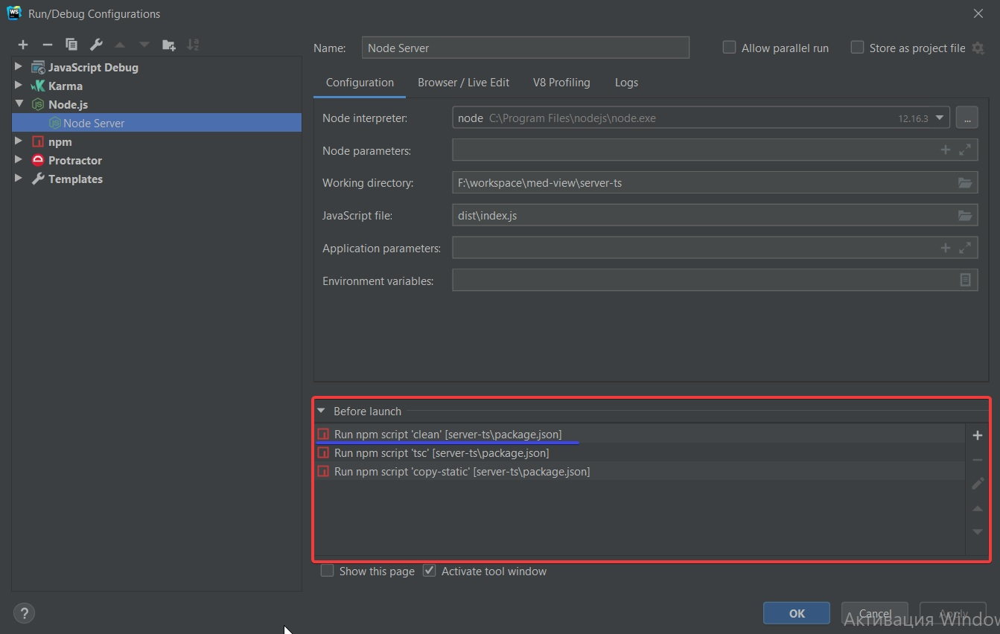

# Stub TypeScript Server v 1.3.2

Приложение предназначено для генерирования данных в формате `.json` основываясь на переданной модели (интерфейса) данных 

## Запуск сервера

Для запуска сервера необходимо ввести в консоли последовательность команд:  
 - `npm clean` для удаления директории скомпилированных файлов `dist` (можно не запускать так как файлы будут перезаписаны, а если нет директории то ошибка)
 - `npm tsc` для компиляции `.ts` файлов в `.js` и создания папки с файлами `dist` (см. `.tsconfig.json` со списком параметров для компилятора);  
 - `npm copy-static` для копирования папки со статическими файлами в частности `index.html` в папку `dist`;
 - `node dist/index.js` последний этап запуск самого сервера NodeJs

Для пользователей IDE от JetBrains приведен скриншот настройки запуска сервера  

  

где особое внимание надо уделить блоку `Before launch` в потором по порядку указываются вызываемые скрипты

Сервер доступен по адресу `http://localhost:3000/`

## Использование

На данный момент все модели необходимо прописывать на прямую в роутере `./src/router/main.ts` по
аналогии с существующими маршрутами  

> Имена типов, а так же комментарии, необходимо указывать в кавычках
  так как это строки и парсятся reqExp-ами 

_пример модели:_    

    {
        id: 'number',   
        photo: 'string',
        firstName: 'string',
        middleName: 'string',
        lastName: 'string',
        birthday: 'string',
        gender: 'string',
        tags: 'TagModel[]',
        maritalStatus: 'string          //@values[\'Холост\', \'Женат/Замужем\'];',
        contact: 'ContactModel',
        address: {
          registration: 'AddressModel',
          actual: 'AddressModel',
        },
        identityDocument: {
          ...
          issueDate: 'string',
          expirationDate: 'string',
        },
        
        genericType: 'Array<number>',
        genericCustomType: 'Array<AllergyModel>',
        tupleType: ['number', 'string'],
        tupleTypeArray: [['number', 'string']],
        ...
      }

Рассмотрим пример подробнее:  
 - Модель представляет собой объект `object` в котором _key = имя параметра_ а _value = строка с описанием типа значения и комментариями_      
 - Существуют (и поддерживаются) три категории типов:  
   *Простые*: `boolean`, `number`, `string`, `any`, `tuple`, `enum`  
   > !Все `enum` должны быть указаны в `Map helpers` файла `./src/files/file-generator.service.ts` со всеми возможными значениями   
   *Пользовательские*: `AllergyModel`, `AddressModel` и тп (т.е. все типы представленные как ссылки на модели или как сама модель указанная `inline`)  
   *Массивы*: `[{...}]`, `Array<T>`, `CustomType[]`  
 - Для улучшения сгенерированных значений предусмотрены сеттеры которые используется если _имя параметра_ попадает под заданные условия  
   *Сеттеры*:
   `id`: номер шага  
   `photo`: картинка переведенная в base64
   `login`, `password` связанные данные зависящие от роли
   `lastName`,`firstName`, `middleName`, `gender` соответственно ФИО и пол взаимосвязанные друг с другом (_от имени мужское или женское зависит пол_)  
   `birthday`, `startDate`, `expirationDate`,  `finishDate`, `issueDate`, `endDate` даты в формате ISO  
   `phone` строка в формате номера мобильного телефона с кодом +375  
   `email` строка с мэйлом example@example.com  
 - Так как сложно предусмотреть все необходимые вариации сеттеров, предусмотрены так называемые *якоря*:  
   якоря указываются в комментариях после символа `@` и до `;`  
   _Список якорей_:  
   `@general;` определяет главное значение от которого зависят другие значения  
    > Используется для генераций значений по ключам `login` и `password`   
   
   `@values[...];` массив предпочитаемых значений для текущего ключа  
   > Если указано, то будут использованы значения из списка, при этом генераторы игнорируются
 - Пользовательские типы могут быть указаны инлайн  
   _Пример_  
   
        key: {
          subKey1: number,
          subKey2: string,
          ...
        } 
        
        и массив:
        
        key: [{
          subKey1: number,
          subKey2: string,
          ...
        }]  
   а так же как ссылка на интерфейс  
   > !Все `CustomType` модели при таком объявлении должны быть указаны в `Map dataModel`
   > файла `./src/file/file-generator.services`  
 
   _Пример_  
   
       key: CustomType   
       
       и массив:
       
       key: CustomType[]  
       
       или  
       
       key: Array<CystomType> 
       
### Использование index.html

Файл `index.html` объявлен в папке `./src/static` и представляет собой интерфейс взаимодействия с сервером  
При переходе по адресу `localhost:3000` срабатывает стартовый роут, который возвращает `.html` страницу  
На странице подключены `cdn bootstrap v4.3.1` и `cdn jQuery v3.2`  
Дальнейшее взаимодействие с сервером ведется посредствам `ajax` запросов используя метод `sendGetRequest('/path/to/route')`      

### Планы на развитие

 - Дополнительные якоря выбора значения при соблюдении условий
 - Парсинг `.ts` файлов моделей и автоматическое заполнение `Map() dataModel` и `Map() helpers`  
 - Возможность написания пользовательских сеттеров
 - Вывод лога генерации на UI 
 - Возможность экспорта файлов с UI
 - Генерация роутов для получения контента сгенерированных файлов
